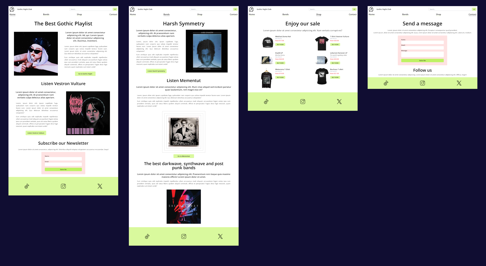
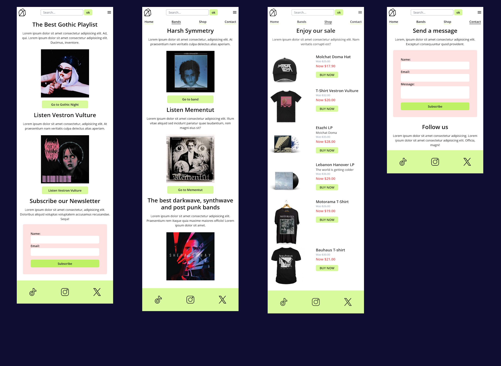

# Gothic Bands 🦇

 This is a project i developed to explore and better understand the usage of [Tailwind CSS](https://tailwindcss.com/) and how it enhances and facilitates responsiveness in web development.

 ## Functionalities

 The project consists of a responsive website with four pages. I utilized JavaScript to implement features such as indicating the active page in the navigation. In the mobile version, there's a hamburger menu that, when clicked, reveals the navigation bar.

## Technologies
Techs used to build this project:

## Overview  

### Mobile

### Gif

